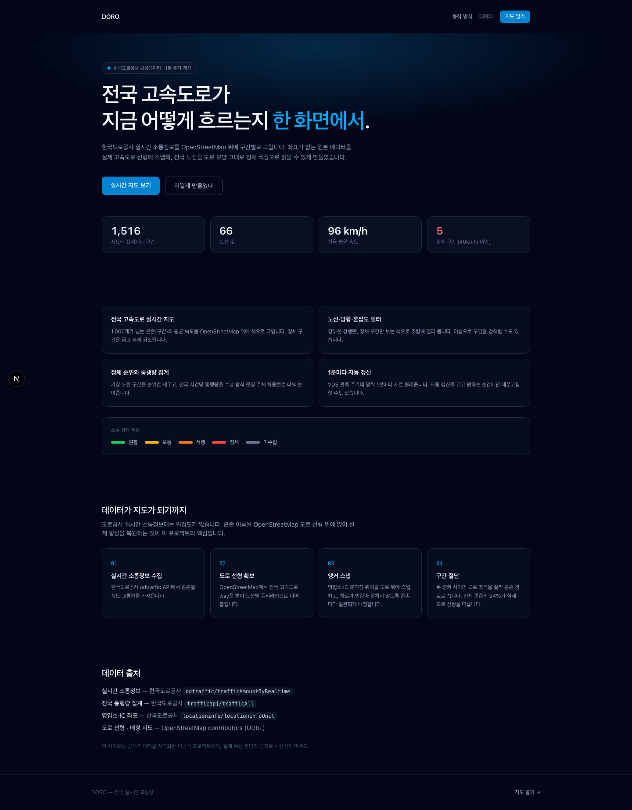
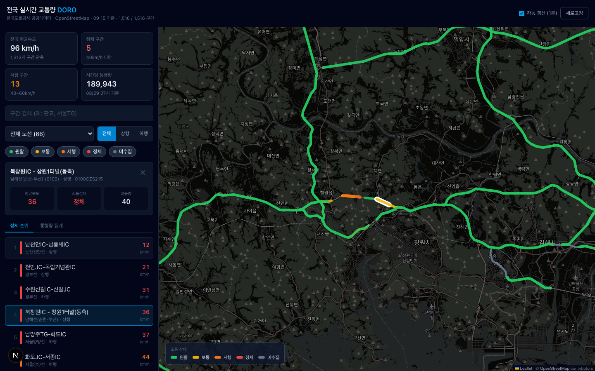

# DORO — 전국 실시간 교통량

한국도로공사 공공데이터를 OpenStreetMap 위에 구간별로 그리는 실시간 고속도로 소통 지도.




- `/` — 랜딩 페이지 (실시간 요약 지표 포함)
- `/live` — 인터랙티브 대시보드

## 무엇이 문제였나

한국도로공사의 실시간 소통정보(`odtraffic/trafficAmountByRealtime`)는 콘존(구간)별 속도와
교통량을 주지만 **위경도가 없다**. 콘존은 `구서IC-영락IC` 처럼 시·종점 이름으로만 식별된다.

IC 좌표만 직선으로 이으면 수도권제1순환선이 서울 도심을 가로지르는 사각형이 된다.
그래서 OpenStreetMap의 실제 고속도로 선형 위에 구간을 얹는다 —
`scripts/build-conzone-paths.mjs`가 하는 일이다.

| 단계 | 내용 |
| --- | --- |
| 1 | Overpass API로 국내 `highway=motorway` way 20,672개(12만 점)를 받는다 (`.osm-cache/`에 캐시) |
| 2 | 노드 id를 공유하는 way를 이어 붙여 노선별 폴리라인(상·하행 차로 등 컴포넌트)으로 만든다 |
| 3 | 앵커를 모은다 — 도로공사 영업소 590곳 + OSM 분기점 노드 3,132개 |
| 4 | 콘존명을 시·종점으로 쪼개 앵커를 찾고 각 컴포넌트에 스냅한다 |
| 5 | Viterbi로 **콘존마다** 어느 컴포넌트에 놓을지 정한다 (아래 참고) |
| 6 | 앵커가 없는 끝점은 이웃 사이의 주행거리로 보간·외삽하고, 두 지점 사이의 도로 조각을 잘라낸다 |

결과: 1,579개 콘존 중 **1,483개(94%)** 가 실제 도로 선형을 따르고, 33개는 앵커 직선으로
대체된다. 나머지 63개는 그리지 않는다.

산출물은 `data/conzone-paths.json`에 `{ roads, straight }` 두 맵으로 커밋되어 있고,
런타임(`lib/geometry.ts`)은 콘존 id로 조회만 한다. 노선이 바뀌면 다시 생성한다.

```bash
npm run build:paths
```

## 기능

- 전국 고속도로 구간을 평균 속도에 따라 색·굵기로 표시 (원활/보통/서행/정체/미수집)
- 노선·방향(상행/하행)·혼잡도 필터, 구간 이름 검색
- 정체 순위 목록 — 클릭하면 지도가 해당 구간으로 이동하고 상세를 보여줌
- 전국 시간당 통행량 집계 (수납 방식·운영 주체·차종별)
- 1분 주기 자동 갱신 (끄고 수동 새로고침 가능)

## 실행

```bash
npm install
echo "EX_API_KEY=발급받은_키" > .env.local
npm run dev
```

API 키는 [공공데이터 포털(data.ex.co.kr)](https://data.ex.co.kr/portal/openapi/openApiInfoM)에서 발급받는다.

## 데이터 출처

| 데이터 | 엔드포인트 |
| --- | --- |
| 실시간 소통정보 | `odtraffic/trafficAmountByRealtime` |
| 전국 통행량 집계 | `trafficapi/trafficAll` |
| 영업소·IC 좌표 | `locationinfo/locationinfoUnit` (`data/units.json`에 스냅숏) |
| 고속도로 선형 · 분기점 | OpenStreetMap / Overpass API (ODbL) |
| 배경 지도 | OpenStreetMap 표준 타일 |

## 구현 노트

- **UA 헤더 필수** — 기본 User-Agent로 호출하면 도로공사 WAF가 `400 Request Blocked`를 반환한다. `lib/ex-api.ts`에서 브라우저 UA를 명시한다.
- **인메모리 캐시** — 실시간 응답이 약 3MB라 Next.js 데이터 캐시(2MB 한도)에 들어가지 않는다. `lib/memo-cache.ts`가 프로세스 수준에서 60초간 재사용하고 동시 요청을 합친다.
- **오프라인 픽스처** — WAF에 일시 차단되면 `EX_FIXTURE_DIR`에 저장한 응답으로 개발할 수 있다 (운영에서는 무시).
- **다크 지도** — OSM 표준 타일에 CSS 필터(`.leaflet-tile-pane`)로 다크 톤을 입힌다. 구간 선은 overlay pane이라 영향받지 않는다.
- **IC와 JC는 다른 지점** — `노포IC`와 `노포JC`는 수백 m 떨어져 있다. 접미사를 통째로 떼면 같은 앵커로 붙어 길이 0인 구간이 된다. 시설 종류를 남긴 키로 먼저 찾고, 실패할 때만 이름만으로 되돌아간다.
- **차로 배정은 콘존 단위 Viterbi** — IC 앵커는 상·하행 차로 사이에 찍혀 있어, 가장 가까운 차로만 고르면 구간마다 상·하행이 번갈아 잡힌다(적용률 43%). 스냅 거리를 관측 비용, 차로 변경을 페널티로 두고 Viterbi를 돌린다. 배정 단위는 노드가 아니라 **콘존**이어야 한다 — 콘존은 하나의 도로 조각 위에 있어야 하고, 도로가 끊긴 곳에서는 콘존 경계에서 조각을 바꿔야 하기 때문이다.
- **길이 0인 도로 조각을 버린다** — 램프 흔적 같은 0km 조각이 남아 있으면 스냅을 가로채 모든 앵커가 같은 지점(`@0.0km`)에 붙는다.
- **끊긴 조각은 잇지 않는다** — 끝점이 가깝고 방향이 맞는 조각을 이어 붙여 봤지만, 잘못 이어진 조각 때문에 비정상 구간이 6개에서 121개로 늘었다. 되돌렸다.

## 주의

공개 데이터를 시각화한 비공식 프로젝트다. 실제 주행 판단의 근거로 쓰지 말 것.
OpenStreetMap 타일은 [타일 사용 정책](https://operations.osmfoundation.org/policies/tiles/)을 따른다.
